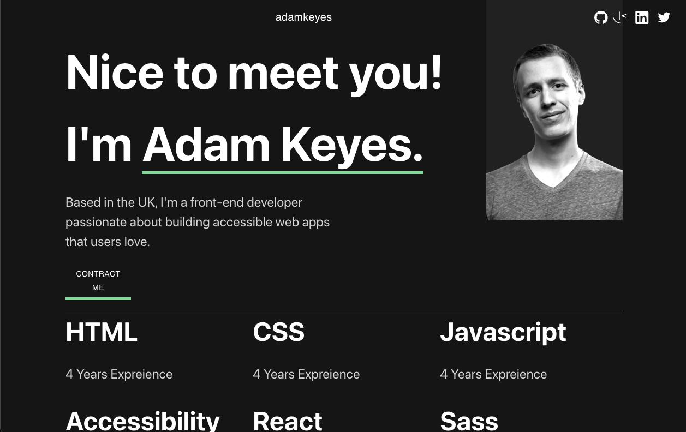

# Frontend Mentor - Single-page developer portfolio solution

This is a solution to the [Single-page developer portfolio challenge on Frontend Mentor](https://www.frontendmentor.io/challenges/singlepage-developer-portfolio-bBVj2ZPi-x). Frontend Mentor challenges help you improve your coding skills by building realistic projects.

## Table of contents

- [Overview](#overview)
  - [The challenge](#the-challenge)
  - [Screenshot](#screenshot)
  - [Links](#links)
- [My process](#my-process)
  - [Built with](#built-with)
  - [What I learned](#what-i-learned)
  - [Continued development](#continued-development)
  - [Useful resources](#useful-resources)
- [Author](#author)
- [Acknowledgments](#acknowledgments)

**Note: Delete this note and update the table of contents based on what sections you keep.**

## Overview

### The challenge

Users should be able to:

- Receive an error message when the `form` is submitted if:
  - Any field is empty
  - The email address is not formatted correctly
- View the optimal layout for the interface depending on their device's screen size
- See hover and focus states for all interactive elements on the page
- **Bonus**: Hook the form up so it sends and stores the user's enquiry (you can use a spreadsheet or Airtable to save the enquiries)
- **Bonus**: Add your own details (image, skills, projects) to replace the ones in the design

### Screenshot



### Links

- Front Mentor URL: [https://www.frontendmentor.io/solutions/practice-with-mui-CmWiss2MvY](https://www.frontendmentor.io/solutions/practice-with-mui-CmWiss2MvY)
- Solution URL: [https://github.com/Chious/front-mentor-single-developer-profolio](https://github.com/Chious/front-mentor-single-developer-profolio)
- Live Site URL:[https://sensational-monstera-fd49eb.netlify.app](https://sensational-monstera-fd49eb.netlify.app)

## My process

### Built with

- [React](https://reactjs.org/) - JS library
- MUI

### What I learned

1. How to customize form by MUI `TextField`

- `value`: handle typing value
- `onChange`: update value to useState
- `error` & `.match()`: check if value is valid.

2. How to show layout while hover.

```html
<div className="container">
  
  <div className="overlay">This is an overlay</div>
</div>
```

Setting them by define `position` and `z-index` by css

### Continued development

- Use Google App Script to handle submit.
- Customize profolio for myself :D
- define style by css, and code would be not that redundant.

### Useful resources

- [How to set TextField in MUI](https://stackoverflow.com/questions/61016202/react-how-to-conditionally-override-textfield-error-color-in-material-ui) - This helped me for XYZ reason. I really liked this pattern and will use it going forward.
- [position absolute vs relative (Traditional Chinese)](http://www.eion.com.tw/Blogger/?Pid=1120) - Help me to position layout correctly.

## Author

- Github - [Chious](https://github.com/Chious)
- Frontend Mentor - [@Chious](https://www.frontendmentor.io/profile/Chious)

## Acknowledgments

None
